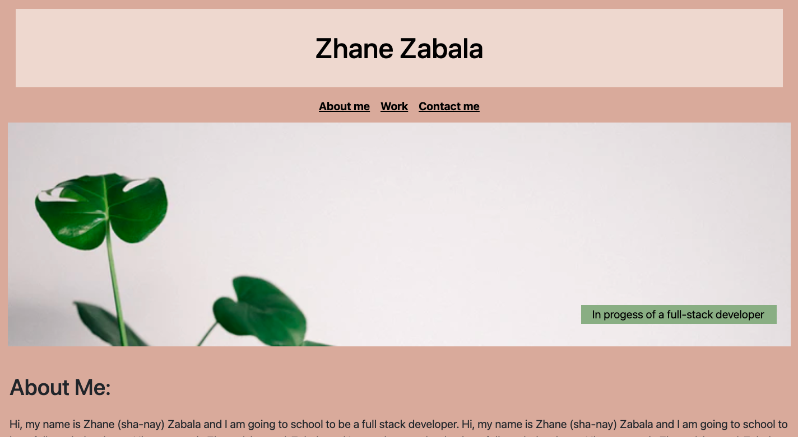
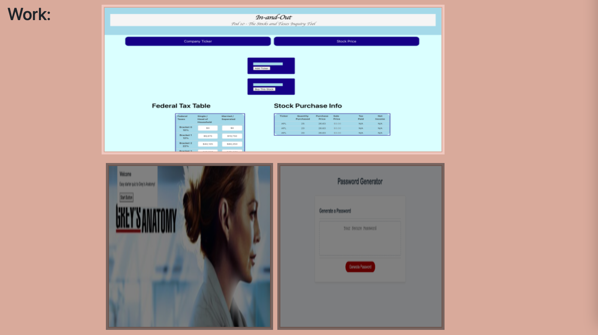
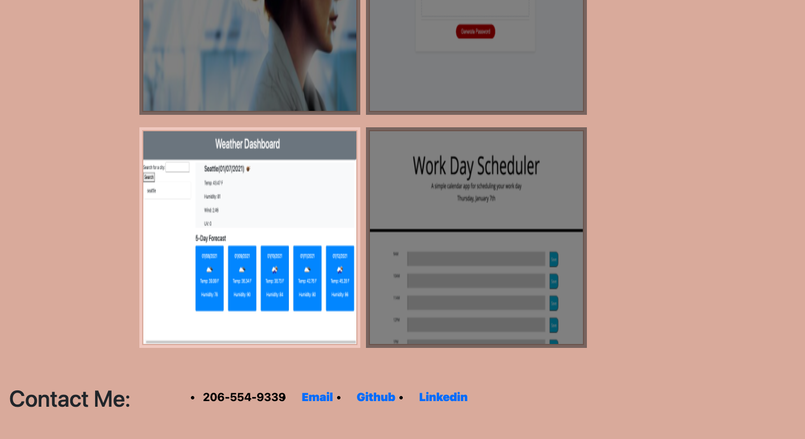

# Updated-Portfolio

In this assignment I had to update the portfolio. It included header with your name and a nav bar. I created "about me", "work", and "contact" sections. My work section has my current pictures of my homeworks and project one. My phone number, email, github and linkedin are current.

 

